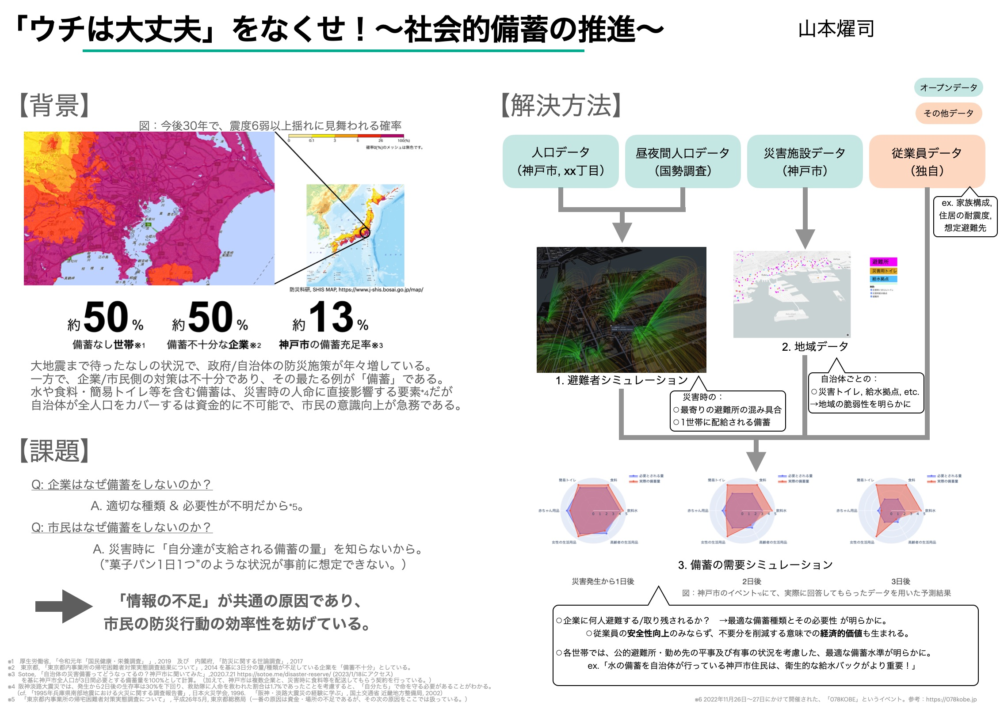
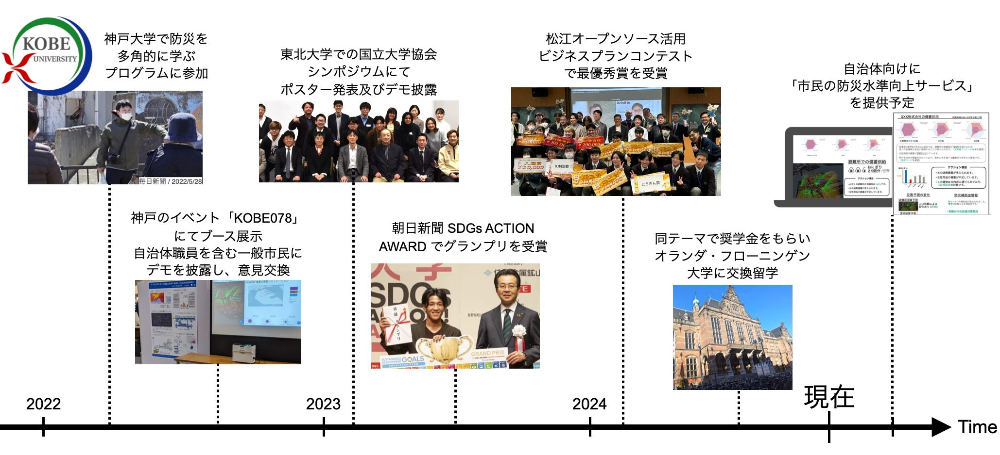
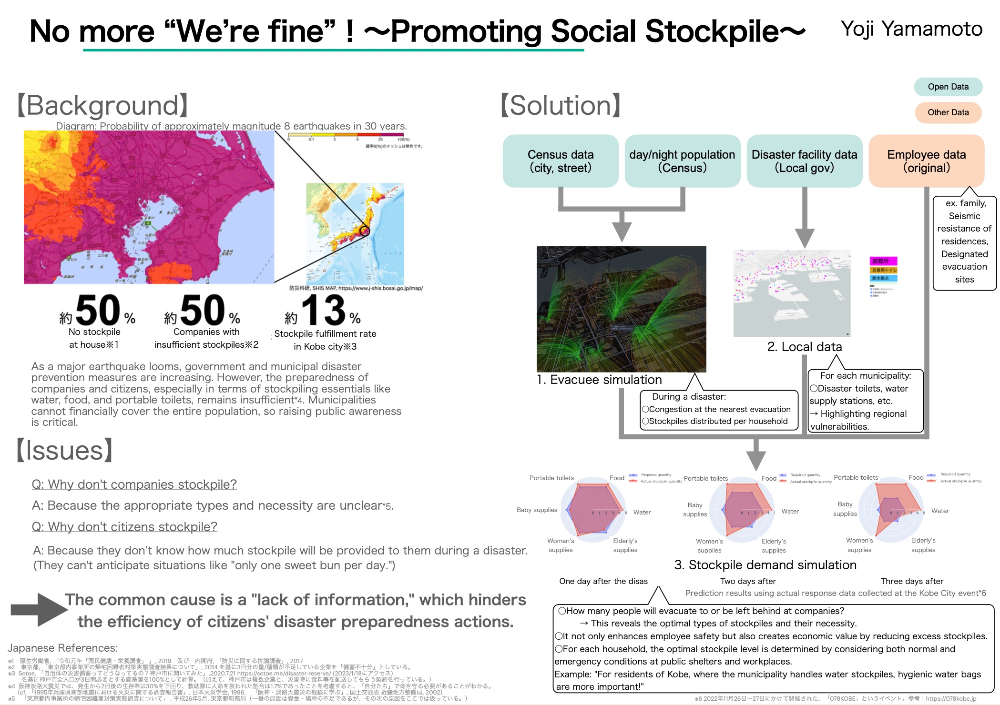

## 概要（Japanese）

 

## プロジェクトの略歴

メディアへの掲載は[こちら](https://docs.google.com/document/d/17jxILKQqHDKbV4taA3Bk9zc9QRoaRBVgLixNeis8jHk/edit?usp=sharing)

 

## About the Project （English）

    

### a poster url: https://drive.google.com/file/d/1akOgm2fEs7MvnehQIvKutytBIMOo1fe8/view?usp=sharing

# Stockpile Demand Simulator × Evacuee Simulatior

This contains two simulators.
- stockpile demand simulator.
- evacuee simulator.

 

image.1 stockpile demand simulator

    

image.2 evacuee simulator

  

# CopyRight

Copyright (c) 2022 Yoji 

## Others
- a dash prototype environment  
Copyright (c) 2019 Jucy Technologies, Inc.
